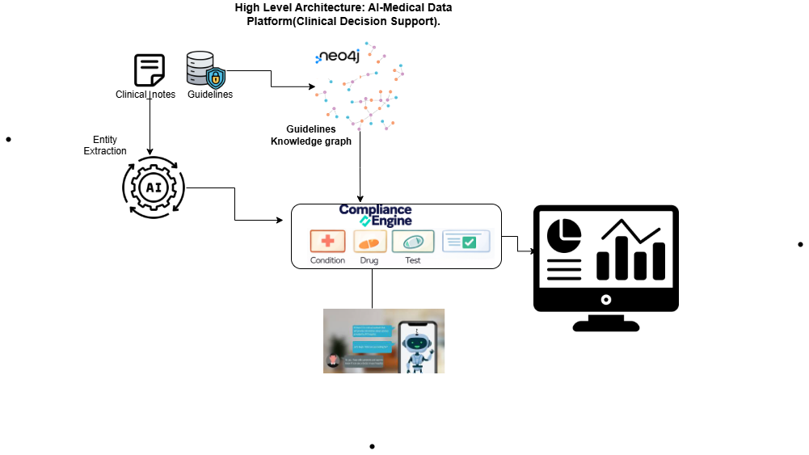
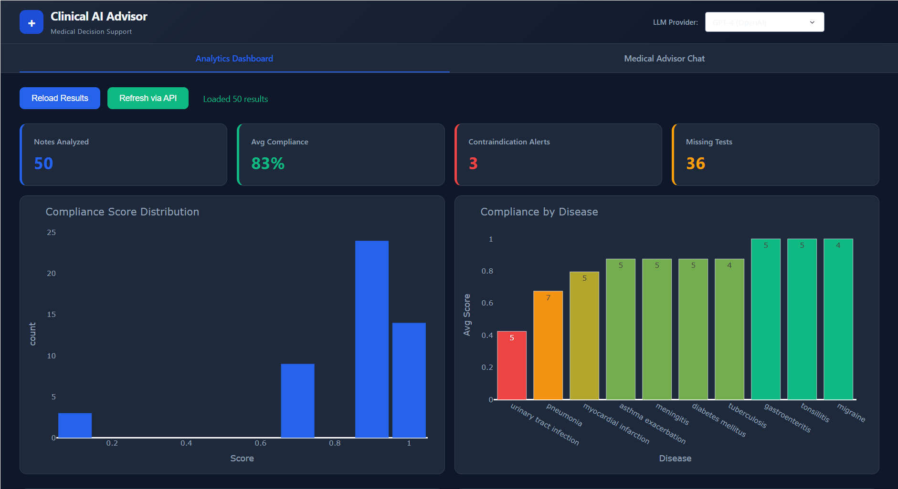
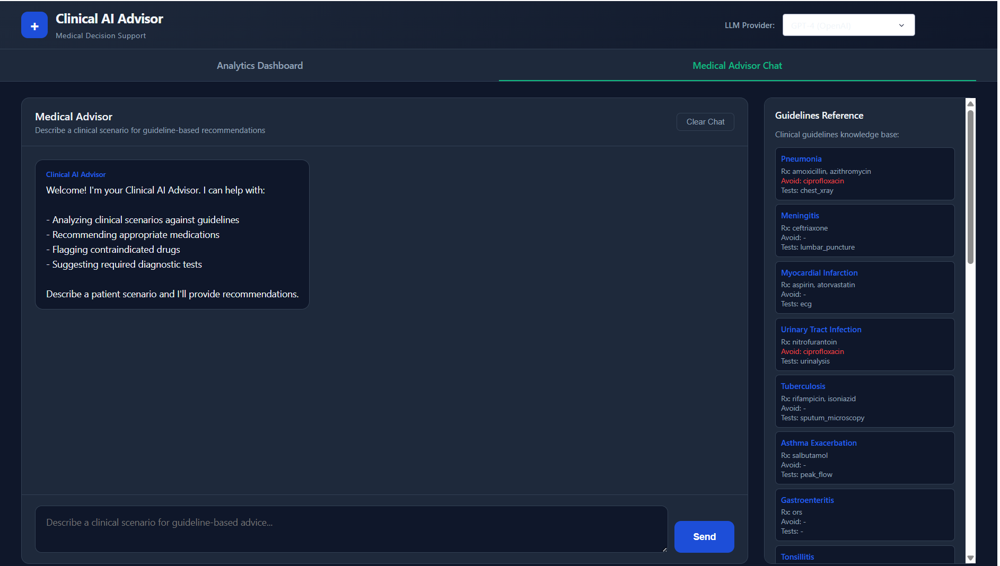

# AI Medical Data Platform

A clinical decision support system that uses LLM-based semantic understanding to analyze free-text clinical notes against medical guidelines stored in a Neo4j knowledge graph. The system extracts entities, matches diagnoses to guidelines, scores treatment compliance, generates explanations, and provides a Medical Advisor chatbot -- all accessible through an interactive analytics dashboard.

**Developed with Python 3.13.3** | **Fully Dockerized** | **Local-first: Ollama runs inside Docker**

> **GitHub Repository:** [git@github.com:Ngoga-Musagi/AI-Medical-Platform.git](https://github.com/Ngoga-Musagi/AI-Medical-Platform)

---

## System Overview


*The platform processes 50 synthetic clinical notes through a 4-step LLM pipeline, stores medical knowledge in Neo4j, and presents results through an interactive Dash dashboard with an integrated Medical Advisor chatbot.*

---

## High-Level System Architecture



Each clinical note goes through **4 sequential LLM calls**, making this a deeply semantic pipeline. Clinical notes are **free-form plain text**, not structured data, so every step requires LLM understanding:

```
Clinical Note (free text)
        |
        v
 +------------------+
 | 1. EXTRACTION     |  LLM Call #1: Extract age, sex, symptoms, diagnosis, medications
 |    (predictor.py) |  from unstructured text using few-shot prompting
 +--------+---------+
          |
          v
 +------------------+
 | 2. MATCHING       |  LLM Call #2: Semantically match extracted diagnosis to the
 |    (evaluator.py) |  closest disease in Neo4j knowledge graph (handles synonyms,
 |                   |  abbreviations like "UTI" -> "urinary tract infection")
 +--------+---------+
          |
          v
 +------------------+
 | 3. COMPLIANCE     |  LLM Call #3: Semantic drug name matching for compliance scoring
 |    (engine.py)    |  (e.g., "Tylenol" matches "paracetamol") + deterministic
 |                   |  weighted scoring: Medication 40% + Contraindication 35% + Tests 25%
 +--------+---------+
          |
          v
 +------------------+
 | 4. EXPLANATION    |  LLM Call #4: Generate human-readable rationale explaining
 |    (explainer.py) |  diagnosis evidence, medication assessment, and recommendations
 +------------------+
```

### Service Architecture (Docker Compose)

```
                              +-------------------+
                              |  Dashboard :8050  |
                              |  (Dash Analytics  |
                              |  + Chat UI)       |
                              +--------+----------+
                                       |
                              +--------v----------+
                              |    API :8000      |
                              |  FastAPI REST     |
                              | /analyze_note     |
                              | /chat             |
                              | /set_provider     |
                              +---+----------+----+
                                  |          |
                         +--------v--+  +----v----------+
                         | Ollama    |  | Neo4j :7687   |
                         | :11434    |  | Knowledge     |
                         | (Docker)  |  | Graph         |
                         | Mistral / |  | (19 diseases) |
                         | Llama3    |  +---------------+
                         +-----------+
```

All 5 services (Ollama, Ollama-pull, Neo4j, API, Dashboard) run inside Docker containers. Ollama stores models in a persistent Docker volume so models download only once.

---

## Neo4j Knowledge Graph

The knowledge graph stores 19 clinical disease guidelines as a connected graph, enabling structured reasoning about treatments.

### Schema

```
(:Disease {name})
    -[:RECOMMENDED_DRUG]->    (:Drug {name})
    -[:CONTRAINDICATED_DRUG]-> (:Drug {name})
    -[:REQUIRES_TEST]->       (:Test {name})
```

### How It Works

1. **Node Creation**: On startup, `evaluator.py` loads `outputs/guidelines.json` and creates nodes for each Disease, Drug, and Test using Cypher `MERGE` statements.
2. **Relationship Creation**: Three relationship types connect diseases to their clinical context:
   - `RECOMMENDED_DRUG` -- drugs that should be prescribed for this disease
   - `CONTRAINDICATED_DRUG` -- drugs that must NOT be prescribed (triggers CRITICAL alerts)
   - `REQUIRES_TEST` -- diagnostic tests that should be ordered
3. **Semantic Query**: When a clinical note is analyzed, the LLM matches the extracted diagnosis to the closest disease in the graph. Then Neo4j is queried with Cypher to retrieve all connected drugs and tests for compliance scoring.

**Example Cypher Query:**
```cypher
MATCH (d:Disease {name: "pneumonia"})
OPTIONAL MATCH (d)-[:RECOMMENDED_DRUG]->(rec:Drug)
OPTIONAL MATCH (d)-[:CONTRAINDICATED_DRUG]->(contra:Drug)
OPTIONAL MATCH (d)-[:REQUIRES_TEST]->(test:Test)
RETURN d.name, collect(DISTINCT rec.name), collect(DISTINCT contra.name), collect(DISTINCT test.name)
```

**Graph Statistics:** 19 diseases, 19+ drugs, 15+ tests, 40+ relationships.

---

## Compliance Scoring -- How It Works

The compliance engine produces a score between 0.0 and 1.0 for each clinical note, using a **deterministic weighted formula**:

```
Overall Score = (0.40 x Medication Score) + (0.35 x Contraindication Score) + (0.25 x Test Score)
```

| Component | Weight | Score Logic | Example |
|-----------|--------|------------|---------|
| **Medication Compliance** | 40% | Ratio of guideline-recommended drugs that were prescribed. Uses LLM semantic matching (e.g., "Tylenol" = "paracetamol"). Score = matches / max(recommended, prescribed). | Pneumonia patient on amoxicillin: 1/2 recommended drugs prescribed = 0.50 |
| **Contraindication Check** | 35% | Binary: 1.0 if no contraindicated drugs prescribed, **0.0 if any found** (triggers CRITICAL alert). Most safety-critical component. | UTI patient on ciprofloxacin (contraindicated): score = 0.0, CRITICAL alert |
| **Test Completeness** | 25% | Checks if required diagnostic tests were ordered. Since clinical notes rarely mention test orders, partial credit of 0.5 is given when tests are required, 1.0 when no tests are required by guidelines. | Pneumonia requires chest X-ray: score = 0.5 (flagged as recommendation) |

### Display Statuses on Dashboard

| Status | Condition | Color |
|--------|-----------|-------|
| **Compliant** | Overall score >= 0.80 | Green |
| **Partially Compliant** | Overall score 0.50 - 0.79 | Yellow |
| **Non-Compliant** | Overall score < 0.50 | Red |
| **CRITICAL** | Any contraindicated drug found | Red (with alert) |

---

## Medical Advisor Chatbot (Agent)

The Medical Advisor is a conversational AI agent (`src/chatbot/agent.py`) that helps doctors get guideline-grounded clinical recommendations.

### How the Agent Works

1. **Guidelines Context**: On initialization, the agent loads all 19 disease guidelines and formats them into a structured system prompt.
2. **System Prompt Engineering**: The agent's system prompt includes all guidelines plus rules about flagging contraindications, recommending tests, and citing guideline sources.
3. **Conversation Memory**: Each session maintains a conversation history (last 10 exchanges), allowing follow-up questions.
4. **Dynamic Guideline Detection**: After each response, the agent scans both the user query and the LLM response to detect which specific guidelines were referenced, returning them as structured metadata with drug/test details.
5. **Any LLM Backend**: Works with all configured providers (Ollama, Gemini, Claude, OpenAI) through the shared `LLMClient`.

---

## LLM Provider Comparison

The system supports multiple LLM providers. Each clinical note requires **~4 LLM calls** (extraction + matching + compliance + explanation), so inference speed directly impacts throughput.

### Hypothetical Performance Comparison

| Provider | Type | Inference Speed | Cost | API Key Required | Privacy |
|----------|------|----------------|------|-----------------|---------|
| **Mistral 7B** (Docker Ollama) | Local (CPU) | Slower (~8-15s/note) | Free | No | Full -- data stays in Docker |
| **Llama 3 8B** (Docker Ollama) | Local (CPU) | Slower (~10-18s/note) | Free | No | Full -- data stays in Docker |
| **Meditron 7B** (Docker Ollama) | Local (CPU) | Slower (~10-20s/note) | Free | No | Full -- data stays in Docker |
| **Gemini 2.0 Flash** | Cloud API | Fast (~1-2s/note) | Free tier | Yes (free) | Data sent to Google |
| **Claude Sonnet** | Cloud API | Fast (~1-3s/note) | **Paid** | Yes (paid) | Data sent to Anthropic |
| **GPT-4 Turbo** | Cloud API | Fast (~1-3s/note) | **Paid** | Yes (paid) | Data sent to OpenAI |

> **Note on inference speed:** Local models (Ollama) run on **CPU inference inside Docker**, which is significantly slower than cloud-hosted GPU inference. Cloud APIs (Gemini, Claude, OpenAI) run on optimized GPU clusters, resulting in much faster response times. The trade-off is **privacy vs. speed**: local models keep all data on your infrastructure, while cloud APIs send data externally.

### API Key Requirements

| Provider | Key Required | How to Get |
|----------|-------------|------------|
| **Ollama (local)** | No key needed | Runs in Docker automatically |
| **Gemini** | `GEMINI_API_KEY` | Free at [Google AI Studio](https://makersuite.google.com/app/apikey) |
| **Claude** | `ANTHROPIC_API_KEY` | **Paid** at [Anthropic Console](https://console.anthropic.com/) |
| **OpenAI** | `OPENAI_API_KEY` | **Paid** at [OpenAI Platform](https://platform.openai.com/api-keys) |

> Set API keys in the `.env` file. See **`.env.example`** for the full configuration template.

---

## Dashboard Features

### Analytics Tab



- **Summary Cards**: Total notes analyzed, average compliance score, contraindication alerts, missing tests -- click cards to filter the view
- **Status Filter**: Filter by Compliant, Partially Compliant, CRITICAL, Non-Compliant
- **Compliance Distribution**: Histogram showing the spread of compliance scores
- **Compliance by Disease**: Bar chart with color-coded scores per disease
- **Test Completion**: Stacked bar chart showing average tests ordered vs. missing per disease
- **Alerts by Disease**: Contraindication alert counts per disease
- **Interactive Data Table**: Color-coded rows (green/yellow/red), sortable, filterable, click any row for full detail
- **LLM Provider Selector**: Switch between LLM providers from the navbar dropdown without restarting

### Medical Advisor Chat Tab



- **Chat Interface**: Multi-line input for clinical scenario descriptions
- **Dynamic Guideline Tags**: Each response shows which specific guidelines were referenced
- **Conversation History**: Session-based memory for follow-up questions
- **Guidelines Sidebar**: Quick reference of all 19 disease guidelines with drugs and tests
- **Quick Prompts**: Pre-built clinical scenarios for testing

---

## Project Structure

```
AI-Medical-Platform/
├── README.md                           # This file
├── Report.md                           # Detailed project report
├── Dockerfile                          # Python 3.9-slim container for API + Dashboard
├── docker-compose.yml                  # 5 services: Ollama, Ollama-pull, Neo4j, API, Dashboard
├── requirements.txt                    # Python dependencies
├── run.sh                              # Cross-platform startup script
├── run_batch.py                        # Batch analyze all 50 notes via API
├── .env.example                        # Template configuration (copy to .env)
├── .gitignore
│
├── src/
│   ├── config.py                       # Centralized configuration
│   ├── llm_client.py                   # Shared LLM client (Ollama/Claude/OpenAI/Gemini)
│   ├── extraction/
│   │   └── predictor.py                # LLM entity extraction (few-shot prompts)
│   ├── guideline_engine/
│   │   └── evaluator.py                # Neo4j knowledge graph + LLM semantic matching
│   ├── compliance/
│   │   └── engine.py                   # Deterministic weighted compliance scoring
│   ├── explainability/
│   │   └── explainer.py                # LLM rationale generation
│   ├── chatbot/
│   │   └── agent.py                    # Medical Advisor chatbot agent
│   ├── api/
│   │   └── app.py                      # FastAPI REST API
│   ├── dashboard/
│   │   └── app.py                      # Dash analytics + chat interface
│   ├── evaluation/
│   │   └── evaluate.py                 # Evaluation engine (F1, accuracy)
│   └── mlops/
│       └── tracker.py                  # Prediction logging + performance tracking
│
└── outputs/
    ├── guidelines.json                 # 19 clinical guidelines
    ├── clinical_notes.json             # 50 synthetic clinical notes
    ├── ground_truth.json               # Ground truth for 15 notes
    └── sample_predictions.json         # Sample prediction output
```

---

## Quick Start

### Prerequisites

- **Docker Desktop** (includes Docker Compose V2)
  - [Windows](https://docs.docker.com/desktop/install/windows-install/) | [macOS](https://docs.docker.com/desktop/install/mac-install/) | [Linux](https://docs.docker.com/desktop/install/linux-install/)
- **Git Bash** (Windows only -- comes with [Git for Windows](https://git-scm.com/download/win))
- No local Ollama install needed -- it runs inside Docker

### 1. Clone and Configure

```bash
git clone git@github.com:Ngoga-Musagi/AI-Medical-Platform.git
cd AI-Medical-Platform

# Copy the example config (edit .env to add API keys for cloud providers)
cp .env.example .env
```

> See **`.env.example`** for all configuration options. The default uses **ollama-mistral** which needs no API keys.

### 2. Start the Platform

```bash
# Linux / macOS:
chmod +x run.sh
./run.sh

# Windows (Git Bash):
bash run.sh

# Or choose a specific provider:
bash run.sh ollama-mistral    # Default (free, private, runs in Docker)
bash run.sh gemini            # Google Gemini (cloud, free tier)
bash run.sh claude            # Claude (cloud, paid API key required)
bash run.sh openai            # GPT-4 (cloud, paid API key required)
```

### 3. Access

| Service | URL |
|---------|-----|
| Dashboard | http://localhost:8050 |
| API Docs (Swagger) | http://localhost:8000/docs |
| API | http://localhost:8000 |
| Neo4j Browser | http://localhost:7474 |

### 4. Run Batch Analysis

```bash
bash run.sh batch
```

### 5. Stop

```bash
bash run.sh stop
```

---

## Useful Commands

```bash
bash run.sh                     # Start (default: ollama-mistral)
bash run.sh gemini              # Start with Gemini
bash run.sh stop                # Stop all services
bash run.sh restart gemini      # Restart with different provider
bash run.sh status              # Container status
bash run.sh logs                # All logs
bash run.sh logs api            # API logs only
bash run.sh batch               # Batch analyze 50 notes
bash run.sh test                # Test all endpoints
bash run.sh pull llama3         # Pull additional Ollama model
```

---

## Troubleshooting

| Issue | Solution |
|-------|----------|
| Docker not running | Start Docker Desktop |
| Port conflicts | Stop conflicting services or change ports in `docker-compose.yml` |
| Slow first start | First run downloads Mistral (~4GB). Check: `docker logs -f medical-ollama-pull` |
| API "degraded" | Neo4j still loading. Wait 15-30s. |
| `\r` errors in run.sh | `sed -i 's/\r$//' run.sh` |
| Permission denied | `chmod +x run.sh` |
